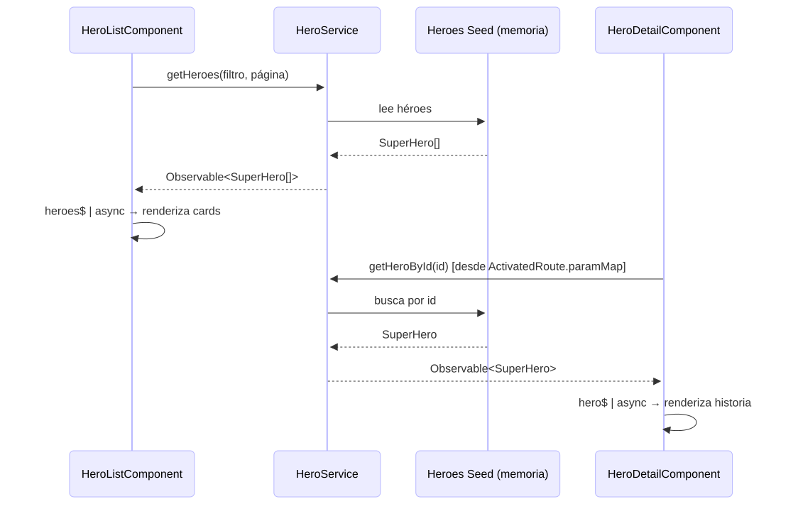
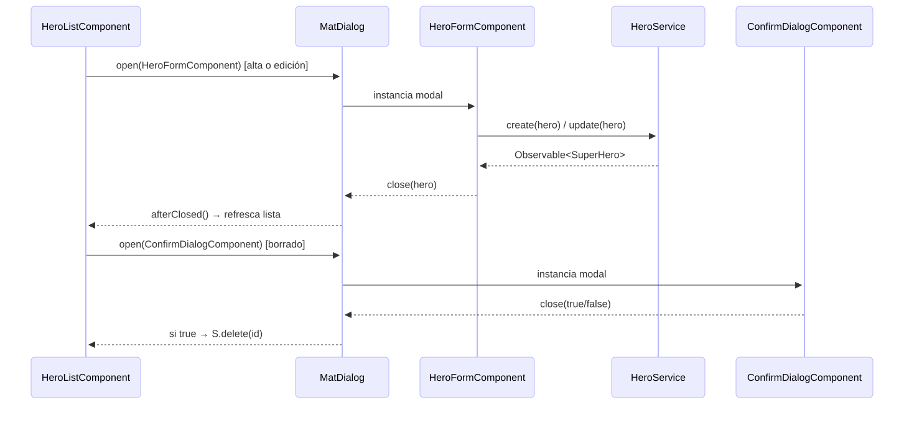
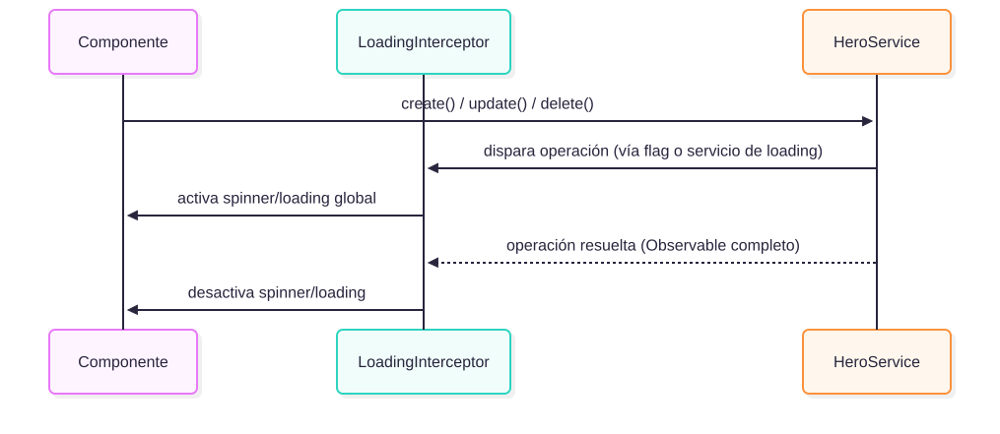
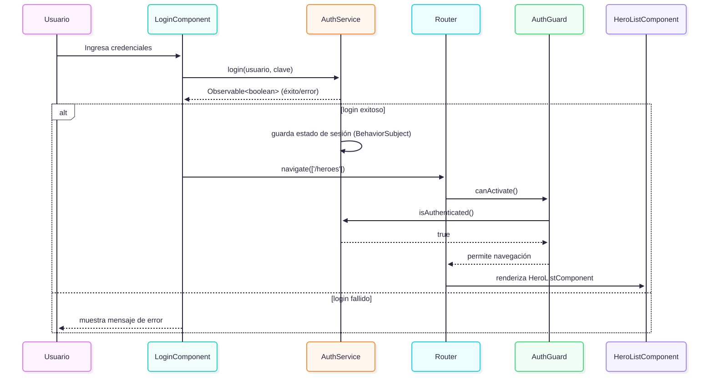

# Mindata-Superheroes-SPA

Aplicación SPA de mantenimiento (CRUD) de súper héroes, desarrollada como prueba técnica para el proceso de Frontend Developer de Mindata.

## Idea inicial del proyecto

La aplicación permite registrar, consultar, filtrar, editar y eliminar súper héroes desde una interfaz paginada, sin depender de un backend real: toda la información se gestiona en memoria a través de un servicio Angular que expone un CRUD completo mediante programación reactiva (RxJS). El alta y la edición se resuelven en un modal (`HeroFormComponent` vía `MatDialog`), mientras que cada card navega a la ruta de detalle del héroe (`/heroes/:id`), donde se despliega su historia completa. Incluye además una pantalla de login (autenticación mock en memoria) que protege el acceso al mantenimiento de héroes mediante un `AuthGuard`, y un set de componentes reutilizables en `shared/` (cards, listas paginadas, buscador) para no repetir UI entre features.

El objetivo no es solo cumplir el checklist funcional, sino demostrar:

- Un modelo de datos bien pensado, no trivial.
- Separación clara de responsabilidades (servicio / componentes / modelos).
- Uso de programación reactiva de punta a punta (Observables, no valores planos).
- Código testeado (cobertura ≥ 80%) y desarrollado bajo TDD.
- Un historial de Git ordenado, con ramas y commits descriptivos.

## Stack tecnológico

| Tecnología       | Versión                          | Motivo                                                                                                                                            |
| ---------------- | -------------------------------- | ------------------------------------------------------------------------------------------------------------------------------------------------- |
| Angular          | **21.x (LTS)**                   | Última versión de Angular en fase de Long Term Support al momento de arrancar el proyecto (Angular 22 aún está en fase de soporte activo, no LTS) |
| Angular Material | **21.x (LTS)**                   | Alineado a la misma major que Angular, para garantizar compatibilidad total                                                                       |
| Angular CDK      | 21.x                             | Utilidades de layout, overlay (diálogos) y accesibilidad, base de Angular Material                                                                |
| RxJS             | ^7.4.0                           | Programación reactiva en el servicio y en los componentes                                                                                         |
| TypeScript       | Última compatible con Angular 21 | Tipado estricto del modelo de datos                                                                                                               |
| Jasmine / Karma  | Incluidos en Angular CLI         | Testing unitario                                                                                                                                  |
| Docker + Nginx   | —                                | Contenedorización y servido del build de producción                                                                                               |

## Arquitectura del proyecto

Arquitectura por features (screaming architecture) con capas transversales en `core/`, separando el dominio (modelos y servicio) de la presentación (componentes):



### Estructura de carpetas

```
src/app/
├── core/
│   ├── interceptors/
│   │   └── loading.interceptor.ts
│   ├── guards/
│   │   └── auth.guard.ts
│   └── directives/
│       └── uppercase.directive.ts
├── features/
│   ├── auth/
│   │   ├── login/
│   │   │   ├── login.component.ts
│   │   │   └── login.component.spec.ts
│   │   └── services/
│   │       └── auth.service.ts
│   └── heroes/
│       ├── models/
│       │   └── super-hero.model.ts
│       ├── services/
│       │   ├── hero.service.ts
│       │   └── hero.service.spec.ts
│       ├── data/
│       │   └── heroes.seed.ts
│       ├── hero-list/
│       │   ├── hero-list.component.ts
│       │   └── hero-list.component.spec.ts
│       ├── hero-detail/
│       │   ├── hero-detail.component.ts
│       │   └── hero-detail.component.spec.ts
│       └── hero-form/
│           ├── hero-form.component.ts       # se abre vía MatDialog, no es ruta
│           └── hero-form.component.spec.ts
├── shared/
│   ├── components/
│   │   ├── card/
│   │   │   ├── card.component.ts
│   │   │   └── card.component.spec.ts
│   │   ├── confirm-dialog/
│   │   │   ├── confirm-dialog.component.ts
│   │   │   └── confirm-dialog.component.spec.ts
│   │   ├── paginated-list/
│   │   │   ├── paginated-list.component.ts
│   │   │   └── paginated-list.component.spec.ts
│   │   ├── search-input/
│   │   │   ├── search-input.component.ts
│   │   │   └── search-input.component.spec.ts
│   │   └── empty-state/
│   │       ├── empty-state.component.ts
│   │       └── empty-state.component.spec.ts
│   └── pipes/
│       └── (pipes reutilizables, si surgen)
└── app.routes.ts
```

**Regla de dependencia:** los componentes de `features/heroes` solo conocen al `HeroService` y al modelo `SuperHero`; nunca acceden directamente al seed de datos. `core/` contiene piezas transversales (interceptor, guard, directiva) que no dependen de ninguna feature. `shared/` contiene componentes de presentación puros (cards, listas paginadas genéricas, buscador, diálogo de confirmación) sin lógica de negocio — reciben datos por `@Input()` y emiten eventos por `@Output()`, para poder reutilizarse tanto en `heroes` como en cualquier feature futura.

**Nota de diseño — Empty State vs. Loading:** se incluye `empty-state` porque cubre un caso real e independiente del loading: cuando el filtro no arroja resultados (o no hay héroes cargados). El estado de carga en sí ya queda cubierto por el `LoadingInterceptor` + spinner global, por lo que no se agrega un componente skeleton — sumarlo sería redundante para el alcance de esta prueba.

## Esquema de comunicación

### 1. Comunicación componente → servicio → estado (flujo de datos)



### 2. Comunicación orientada a eventos entre componentes (alta / edición / borrado)



### 3. Interceptor de loading (transversal a toda operación)



### 4. Login y protección de rutas con Guard



El `AuthGuard` protege la ruta de `heroes` (`canActivate`); si no hay sesión activa, redirige a `/login`. La autenticación también es en memoria (usuario/clave hardcodeados: `admin` / `admin`), consistente con el resto del proyecto: sin backend real.

### Rutas

| Ruta | Componente | Protección | Descripción |
|---|---|---|---|
| `/login` | `LoginComponent` | pública | Autenticación mock en memoria |
| `/heroes` | `HeroListComponent` | `AuthGuard` | Listado paginado/filtrado; alta y edición se abren como modal (`HeroFormComponent`), no navegan a otra ruta |
| `/heroes/:id` | `HeroDetailComponent` | `AuthGuard` | Detalle del héroe (historia, poderes, universo); se llega haciendo click en la card desde el listado |

## Referencia de diseño

Para acelerar el diseño de cards, listas paginadas, formularios y diálogos sin perder tiempo maquetando desde cero, se toma como referencia visual la documentación oficial de **Angular Material**:

**https://material.angular.io/components**

Al ser la fuente oficial de la librería que se instala con `ng add @angular/material`, los patrones (cards, tablas, formularios, dialogs) coinciden exactamente con los componentes reales del proyecto, sin riesgo de adaptar un lenguaje visual ajeno.

## Modelo de datos

```typescript
export interface SuperHero {
    id: string; // UUID, generado con crypto.randomUUID() al crear el héroe
    name: string;
    realName?: string;
    powers?: string[];
    universe?: 'Marvel' | 'DC' | 'Otro';
    history: string;
    imageUrl?: string;
    createdAt: Date;
    updatedAt: Date;
}
```

`history` es el contenido que despliega `HeroDetailComponent` en la ruta `/heroes/:id` — es campo obligatorio porque sin él la ruta de detalle no tendría nada propio que mostrar más allá de lo que ya se ve en la card.

## Instalación y ejecución

```bash
npm install
ng serve
```

## Tests y cobertura

```bash
ng test --code-coverage
```

## Docker

Build multi-stage: compila con Node y sirve el resultado con Nginx (`nginx.conf` incluye el fallback a `index.html` que necesita el router de Angular para rutas como `/heroes/:id`).

```bash
docker build -t mindata-superheroes-spa .
docker run -p 8080:80 mindata-superheroes-spa
```

## Autor

German — Desarrollo para proceso de selección Frontend Developer, Mindata / RIU.
